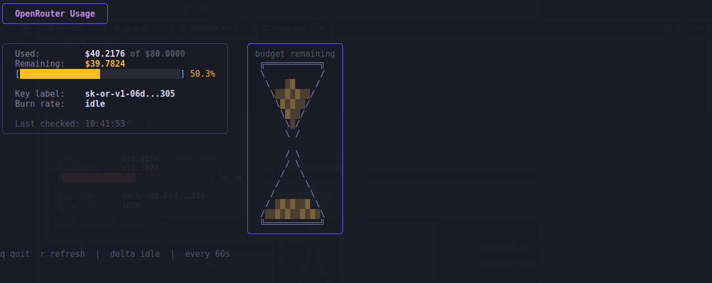

# Open-Hourglass

Just a simple TUI where you input your OpenRouter key and it shows an housglass with flowing sand as quick as you are
burning though your budget.

`go run github.com/SimoneDutto/open-hourglass` in your terminal.

# Example

## Notes

The key is not stored anywhere. The only network call is does with your key is `"https://openrouter.ai/api/v1/key"`, it shouldn't use any credit.
However, use it at your own risk.
